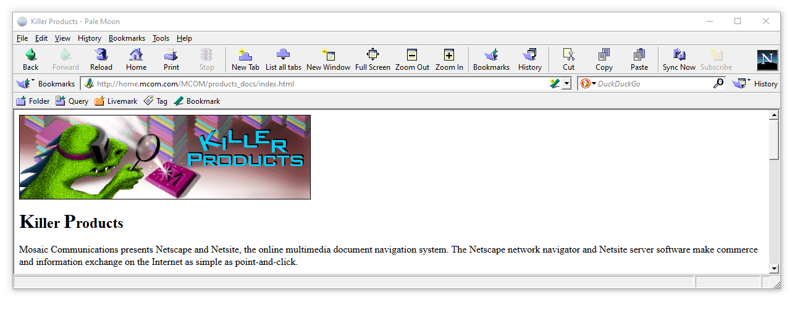
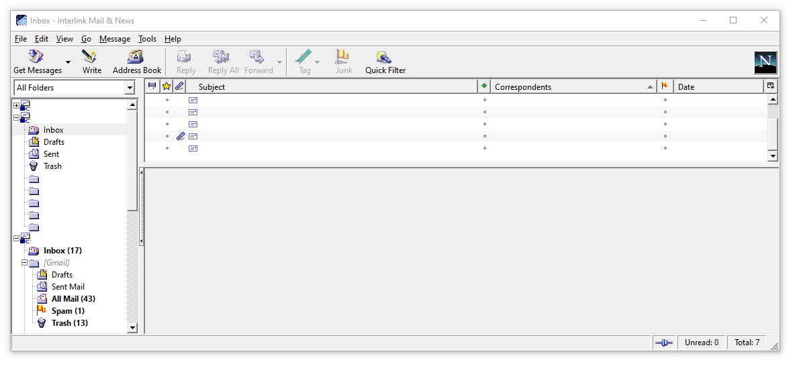

# Moonscape
Features the classic theme that was used in earlier versions of Netscape. It is similar to the look of Netscape 4.x, Netscape 6+ "Classic" theme, Mozilla Suite M18+, and SeaMonkey 1.x "Classic" theme running on Windows. This theme is based on "[FOXSCAPE](http://mw.rat.bz/foxscape/)" by Michael Walden.

## Previews

### Pale Moon

### Interlink Mail & News

## Building
Simply download the contents of the "src" folder  and pack the contents into a .zip file. Then, rename the file to .xpi and drag into the browser.

## Download
Check the releases page of this repository or visit its page on the [Pale Moon Add-ons Site](https://addons.palemoon.org/themes/moonscape)
