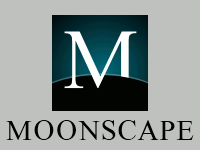

# Moonscape Messenger

Features the classic theme that was used in earlier versions of Netscape. It is similar to the look of Netscape 4.x, Netscape 6+ "Classic" theme, Mozilla Suite M18+, and SeaMonkey 1.x "Classic" theme running on Windows. Most of the graphics were taken from the "[FOXSCAPE](https://addons.mozilla.org/en-US/firefox/addon/foxscape/)" theme by Michael Walden.

A matching Pale Moon version of this theme available [here](https://addons.palemoon.org/themes/moonscape).

## License
All documentation and code contained in this theme is covered by the following license:

[Mozilla Public License, version 2.0](https://www.mozilla.org/en-US/MPL/2.0/)

All images contained in this theme are covered by the following license:

[Creative Commons — Attribution-NonCommercial-ShareAlike 3.0 Unported - CC BY-NC-SA 3.0](http://creativecommons.org/licenses/by-nc-sa/3.0)

## Building
Simply download the contents of the "src" folder  and pack the contents into a .zip file. Then, rename the file to .xpi and drag into the browser.

## Download
Check the releases page of this repository.